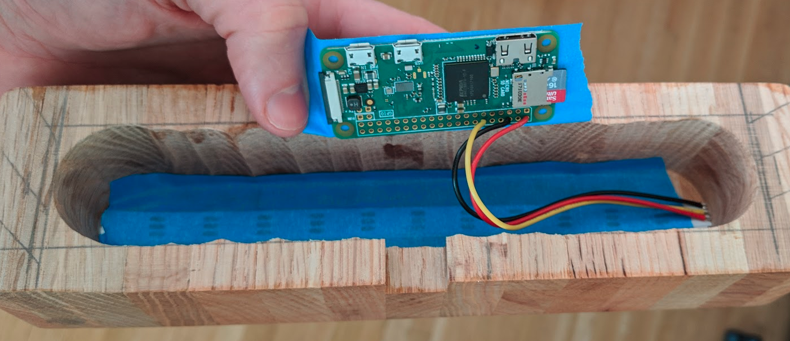

# Gaussmeter

#### gauss
One gauss equals 1×10−4 tesla (100 μT)

#### meter
a device that measures and records the quantity, degree, or rate of something.

# Hardware

## raspbery Pi Zero W

## Neopixel (WS2812)

# Software

## Teslamate

https://teslamate.readthedocs.io/en/v1.18.1/

## teslamater

Teslamate to lumen bridge

https://github.com/gaussmeter/teslamater

## lumen

Drives Neopixels (WS2812)

https://github.com/gaussmeter/query

#### Todo
- examples (curl)
- details
  - lumen: json message format
  - teslamater: config
- document individual projects
- installation
- licenses...

